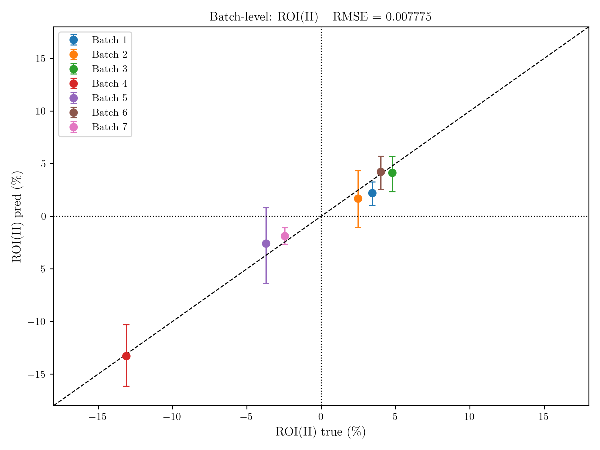

# Final Report

This case study aimed to build a model capable of predicting the **Return on Investment (ROI)** of a cohort (batch) based on the information from its individual loans.

---
## Dataset Description

The provided database contained three distinct tables: **allowlist**, **loans**, and **repayments**:

- **allowlist**: Information on the creation of the cohorts, relating the cohort, the user_id, and the cohort creation/allowlisted date.  
- **loans**: Information on multiple loans, relating loan_id, user_id, loan_amount, loan creation date, and loan status updates.  
- **repayments**: Loan repayment and billing information, relating loan_id, repayment and billing dates, and repayment and billing amounts.  

---
## Exploratory Data Analysis (EDA)

The first step consisted of performing an **Exploratory Data Analysis (EDA)**. I created functions to merge the relevant information across the three tables and analyzed the data through plots showing ROI evolution and correlations between parameters. Another important role of the EDA was defining the **decision time (t)** and **horizon (H)**.

### Main Findings

- The strongest correlations in the dataset were found between **inflow** and **outflow** amounts at both the loan and cohort levels.  
- Weaker but noticeable correlations were found between inflow, outflow and ROI features and loan length/age.  
- From the EDA, it was possible to make estimates for the **decision time (t)** and **horizon (H)**:  
  - From a data-driven perspective, I chose **t = 200 days**, which occurs early enough in most batch lifecycles that corrective measures can still be taken.
  - I chose **H = 730 days (2 years)**, as it provides enough time for cohorts to become profitable. The data indicated that these are not short-term investments (less than one year) but rather long-term commitments.  

---
## Modeling Approach

The modeling process consisted of:  

1. **Feature Engineering**: Constructed cohort-level aggregates (cash inflows, outflows, age, percent repaid, ROI at t).  
2. **Model Selection**: Tested baseline regressors and gradient boosting models.  
3. **Evaluation Metrics**: Root Mean Squared Error (RMSE) and Mean Absolute Error (MAE) were the primary evaluation metrics. Additionally, ROI prediction accuracy by batch was considered.

---
## Results

- **Best Model**: XGBoost -- Scenario 1, Model 2 with filtered dataset (90% upper percentile of loan amount removed).  
- **Evaluation Metrics**:  
  - RMSE: 0.007775  
  - MAE: 0.006783  
- The model successfully captured ROI patterns at both loan and batch levels.  
- The figure below illustrates the best result obtained:  

  

---
## Limitations and Next Steps

Although the model shows promising predictive capacity, there are limitations to consider:  

- **Feature space**: Current features rely only on internal loan and repayment data. Adding user-level demographics or external credit risk indicators could improve predictions.  
- **Data imbalance**: Some batches have limited history or smaller sample sizes, which impacts model generalization.  
- **Business context**: The decision time and horizon were defined from a data-driven perspective, but business-specific goals could adjust these values.  

### Future Work

- Expand feature engineering with temporal and user-level features.
- Validate findings using additional datasets.  

---
## Conclusion

This case study demonstrated the feasibility of predicting the ROI of loan cohorts using historical data. The analysis combined careful EDA, feature construction, and model testing, leading to an interpretable and effective model (XGBoost).  

The methodology provides a solid baseline for production-level improvements, where integration of richer features and business constraints could further enhance predictive performance.
