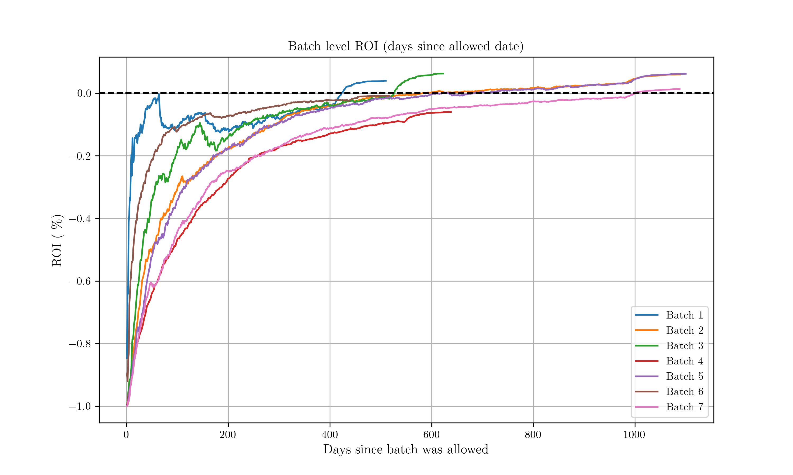
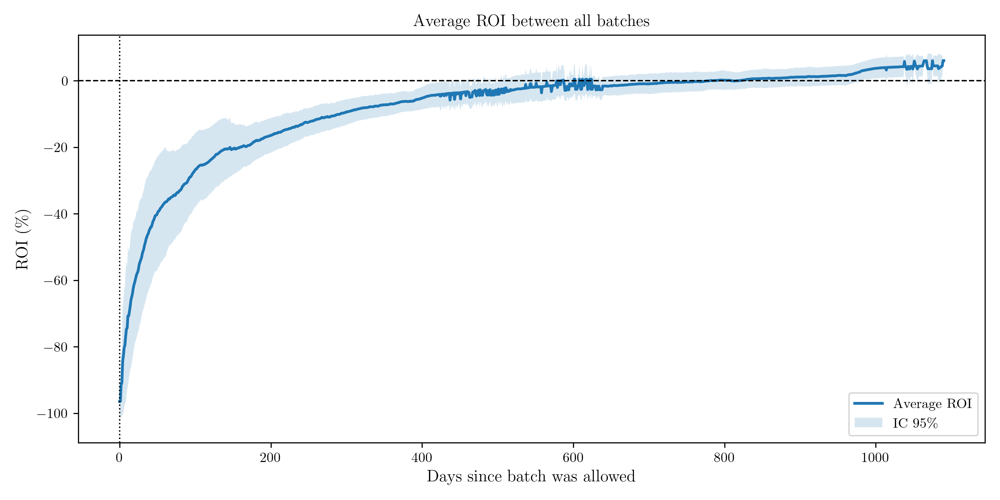

# Final Report

This case study aimed to build a model capable of predicting the **Return on Investment (ROI)** of a cohort (batch) based on the information from its individual loans.

---
## Dataset Description

The provided database contained three distinct tables: **allowlist**, **loans**, and **repayments**:

- **allowlist**: Information on the creation of the cohorts, relating the cohort, the user_id, and the cohort creation/allowlisted date.  
- **loans**: Information on multiple loans, relating loan_id, user_id, loan_amount, loan creation date, and loan status updates.  
- **repayments**: Loan repayment and billing information, relating loan_id, repayment and billing dates, and repayment and billing amounts.  

---
## Exploratory Data Analysis (EDA)

The first step consisted of performing an **Exploratory Data Analysis (EDA)**. I created functions to merge the relevant information across the three tables and analyzed the data through plots showing ROI evolution and correlations between parameters. Another important role of the EDA was defining the **decision time (t)** and **horizon (H)**.

### Main Findings

- The strongest correlations in the dataset were found between **inflow** and **outflow** amounts at both the loan and cohort levels.  
- Weaker but noticeable correlations were found between inflow, outflow and ROI features and loan length/age.  
- From the EDA, it was possible to make estimates for the **decision time (t)** and **horizon (H)**:  
  - From a data-driven perspective, I chose **t = 200 days**, which occurs early enough in most batch lifecycles that corrective measures can still be taken.
  - I chose **H = 730 days (2 years)**, as it provides enough time for cohorts to become profitable. The data indicated that these are not short-term investments (less than one year) but rather long-term commitments.  

The following image shows the evolution of the each batch ROI as a function of the number of days passed since the batch was allowed. Looking at this plot we can see that all batches behave somewhat similarly, and that the ROI for all of them have a fast increase, specially in their first year of the batch existence. After this first rapid growth phase, the ROI increase starts to slow down and enters an "almost-plateau" region.

If we take a look on the ROI average between all batches, we can justify our choice for **t** and pick a value that can be informative of the batch ROI growth and the start of its "almost-plateau" phase. Bellow we have a plot showing exactly this, the average ROI curve between all cohorts, and from this we can safely say that, on average, after 200 days a cohort should already be past its initial fast ROI increase stage, making it a good candidate for decision time **t**. A more aggressive choice could be made taking **t\<200 days**, but it could also lead to higher risks since less would be known about the batches and its loan taking (and payment) behaviour. Similarly, a safer option could be **t\>200 days**, but this approach could also bring risks since it may be too far along the cohort lifecicle to apply any measures to make it profitable.

We can also motivate the choice of the horizon H on the behaviour of the mean batch ROI curve. We see that after around two years (730 days) the mean ROI can cross the threshold from negative to positive (in the 95% CI). Therefore, this can be a good choice for H, since on average we can expect a cohort to become lucrative from here on out.

---
## Modeling Approach

The modeling process consisted of:  

1. **Feature Engineering**: Constructed cohort-level aggregates (cash inflows, outflows, age, percent repaid, ROI at t).  
2. **Model Selection**: Tested baseline regressors and gradient boosting models.  
3. **Evaluation Metrics**: Root Mean Squared Error (RMSE) and Mean Absolute Error (MAE) were the primary evaluation metrics. Additionally, ROI prediction accuracy by batch was considered.

Here I tested four different models, separated in two different scenarios. However, all four models are XBGRegressor based.
Both scenarios aim to predict ROI(H) of our cohorts. 

  **Scenario 1** only consider loans up to the decision time t when computing the true ROI(H) of the cohorts.
  **Scenario 2** considers all loans up to the horizon H in the computation of the true ROI(H) of the cohorts. 
  
These different scenarios lead to a fundamental change in interpretation of the models depending on which one you choose.

---
## Results

- **Best Model**: XBGRegressor -- Scenario 1, Model 2 with filtered dataset (90% upper percentile of loan amount removed).  
- **Evaluation Metrics**:  
  - RMSE: 0.007775  
  - MAE: 0.006783  
- The model successfully captured ROI patterns at both loan and batch levels.  
- The figure below illustrates the best result obtained:  

  

---
## Limitations and Next Steps

Although the model shows promising predictive capacity, there are limitations to consider:  

- **Feature space**: Current features rely only on internal loan and repayment data. Adding user-level demographics or external credit risk indicators could improve predictions.  
- **Data imbalance**: Some batches have limited history or smaller sample sizes, which impacts model generalization.  
- **Business context**: The decision time and horizon were defined from a data-driven perspective, but business-specific goals could adjust these values.  

### Future Work

- Expand feature engineering with temporal and user-level features.
- Validate findings using additional datasets.  

---
## Conclusion

This case study demonstrated the feasibility of predicting the ROI of loan cohorts using historical data. The analysis combined careful EDA, feature construction, and model testing, leading to an interpretable and effective model (XGBoost).  

The methodology provides a solid baseline for production-level improvements, where integration of richer features and business constraints could further enhance predictive performance.
